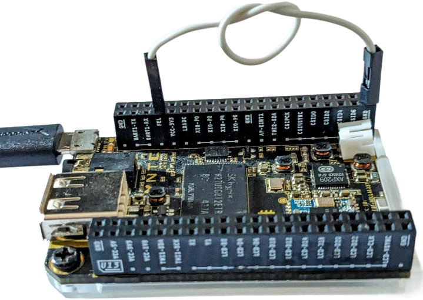
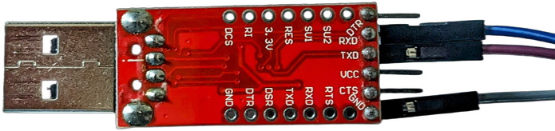
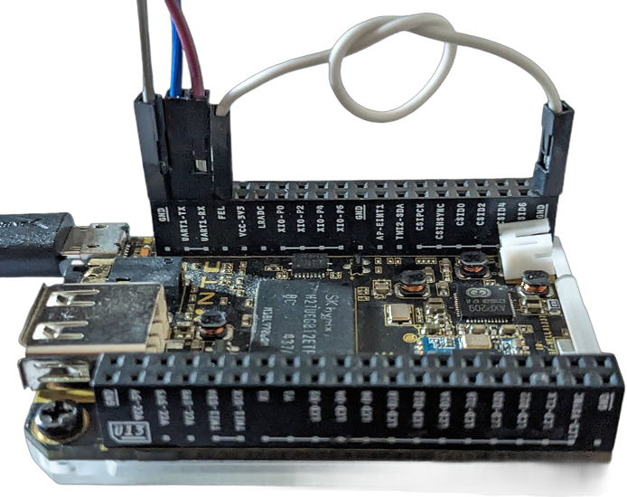

# Warm up: Boot the latest Linux LTS 

In this warm-up exercise we are going to show that C.H.I.P is not dead: We are
booting into the latest Linux LTS release (6.6.63 at the time of writing).

## Hardware

Obviously, we need a CHIP. We also need a USB-data cable connecting CHIP's
micro-USB port to a USB port of the computer we are working on.
Next we need a so-called USB-serial adapter that connects CHIP's UART pins to
another USB port of your workstation.
In addition, we need a jumper wire connecting the FEL-pin on CHIP to a GND-pin
(a conducting paper clip might work, too).
         
## Software Setup

The following has been tested on a `x86_64` computer running Ubuntu 22.04.
These commands are going to install a cross-compiler toolchain, the
`sunxi-fel` tool, the `cu` terminal program, and couple of dependencies:

```shell
sudo bash -c '\
{{#include ../../scripts/install_packages.sh:3:}}'
```

Let us add the current user to the `dialout` group in order to run the `cu`
without being a super-user:
```shell,ignore
sudo adduser $USER dialout
```
For the change to take effect we need to logout and login again.

## FEL

We run the `sunxi-fel` tool to verify CHIP is connected properly in FEL mode.
The `sunxi-fel` tool will also be used to download executable code for
booting CHIP later.

For now, we disconnect CHIP from everything, connect the FEL pin to a GND pin
on CHIP and then use the USB-data cable to connect CHIP's micro USB port to a
USB port of your computer.



Then type:
```shell,ignore
sunxi-fel ver
```

This should produce something like the following output:

```
AWUSBFEX soc=00001625(A13) 00000001 ver=0001 44 08 scratchpad=00007e00 00000000 00000000
```

In case CHIP is not connected properly, or CHIP is not in FEL mode you'll see:

```
ERROR: Allwinner USB FEL device not found!
```

## U-BOOT

We won't directly boot into Linux.
We are going to have the U-Boot boot loader do some initialization of the hardware first.
To download and unpack U-Boot type:

```shell
# Set U-Boot version
export UBOOT_VER=2024.10

echo "# Downloading U-Boot"
mkdir -p download
wget -c -P download https://source.denx.de/u-boot/u-boot/-/archive/v${UBOOT_VER}/u-boot-v${UBOOT_VER}.tar.bz2

echo "# Extracting U-Boot"
mkdir -p build
tar x -C build -f download/u-boot-v${UBOOT_VER}.tar.bz2
```

There's even a default configuration for CHIP in `u-boot-v${UBOOT_VER}/configs/CHIP_defconfig`!

Now, let's build U-Boot for CHIP:

```shell
pushd build/u-boot-v${UBOOT_VER}
ARCH=arm CROSS_COMPILE=arm-linux-gnueabihf- make CHIP_defconfig
ARCH=arm CROSS_COMPILE=arm-linux-gnueabihf- make -j$(nproc)
popd
```
Some explanation: We're calling `make` and set the target architecture to `arm`
and select the `arm-linux-gnueabihf-` toolchain we installed before.



That wasn't too bad, so now let's try to boot CHIP.
First, connect the `TX` wire of your USB serial adapter to CHIP's `RX` pin and
the `RX` wire of your USB serial adapter to CHIP's `TX` pin.
Also connect a `GND` pin of your USB serial adapter to one of CHIP's `GND`
pins:



Then, open a new terminal window in which we're going to run `cu`:
```shell,ignore
cu -l /dev/ttyUSB0 -s 115200
```

Then in our original terminal window in the `build/u-boot-v${UBOOT_VER}` directory, type
```shell,ignore
sunxi-fel -v uboot u-boot-sunxi-with-spl.bin 
```
which should produce something like the following as output:
```
found DT name in SPL header: sun5i-r8-chip
Enabling the L2 cache
Stack pointers: sp_irq=0x00002000, sp=0x00005DF8
Reading the MMU translation table from 0x00008000
Disabling I-cache, MMU and branch prediction... done.
=> Executing the SPL... done.
Setting write-combine mapping for DRAM.
Setting cached mapping for BROM.
Writing back the MMU translation table.
Enabling I-cache, MMU and branch prediction... done.
Writing image "U-Boot 2024.10 for sunxi board", 534068 bytes @ 0x4A000000.
Starting U-Boot (0x4A000000).
```

In our `cu` terminal window we are going to see something similar to:
```
U-Boot SPL 2024.10 (Nov 24 2024 - 23:07:20 +0100)
DRAM: 512 MiB
CPU: 1008000000Hz, AXI/AHB/APB: 3/2/2
Trying to boot from FEL


U-Boot 2024.10 (Nov 24 2024 - 23:07:20 +0100) Allwinner Technology

CPU:   Allwinner A13 (SUN5I)
Model: NextThing C.H.I.P.
DRAM:  512 MiB
Core:  60 devices, 20 uclasses, devicetree: separate
WDT:   Not starting watchdog@1c20c90
Loading Environment from nowhere... OK
DDC: timeout reading EDID
DDC: timeout reading EDID
DDC: timeout reading EDID
Setting up a 720x576i composite-pal console (overscan 32x20)
In:    serial,usbkbd
Out:   serial,vidconsole
Err:   serial,vidconsole
Allwinner mUSB OTG (Peripheral)
Net:   using musb-hdrc, OUT ep1out IN ep1in STATUS ep2in
MAC de:ad:be:ef:00:01
HOST MAC de:ad:be:ef:00:00
RNDIS ready
eth0: usb_ether

starting USB...
Bus usb@1c14000: USB EHCI 1.00
Bus usb@1c14400: USB OHCI 1.0
scanning bus usb@1c14000 for devices... 1 USB Device(s) found
scanning bus usb@1c14400 for devices... 1 USB Device(s) found
       scanning usb for storage devices... 0 Storage Device(s) found
Hit any key to stop autoboot:  0
=>
```

If you're not hitting the "any" key fast enough, U-Boot is going into it's
auto-boot loop. Don't worry that doesn't cause any damage. You'll just have to sit it out.
Eventually you'll end up with an interactive prompt and can go explore.
CHIP's USB port seems to be detected. However, then NAND is not.
We'll get to that later. For now, we've shown we can boot into a recent
U-Boot release which is already great.

## Linux

At the time of writing, the latest Linux LTS kernel is 6.6.63, which we
download and extract by typing:

```shell
export LINUX_VER=6.6.63
wget -c -P download https://cdn.kernel.org/pub/linux/kernel/v6.x/linux-${LINUX_VER}.tar.xz
tar x -C build -f download/linux-${LINUX_VER}.tar.xz
```

Let's try building with the `sunxi_defconfig` which can be found in
`linux-${LINUX_VER}/arch/arm/configs`:

```shell
pushd build/linux-${LINUX_VER}
ARCH=arm CROSS_COMPILE=arm-linux-gnueabihf- make sunxi_defconfig
ARCH=arm CROSS_COMPILE=arm-linux-gnueabihf- make -j$(nproc) zImage
ARCH=arm CROSS_COMPILE=arm-linux-gnueabihf- make -j$(nproc) dtbs
popd
```

OK, now let's boot into Linux:

```shell,ignore
sunxi-fel -v uboot u-boot-v${UBOOT_VER}/u-boot-sunxi-with-spl.bin \
          write 0x42000000 linux-${LINUX_VER}/arch/arm/boot/zImage \
          write 0x43000000 linux-${LINUX_VER}/arch/arm/boot/dts/sun5i-r8-chip.dtb
```

In the `cu` terminal window type:

```
=> bootz 0x42000000 - 0x43000000
```

and you should see Linux trying to boot:

```
Kernel image @ 0x42000000 [ 0x000000 - 0x4eb9f8 ]
## Flattened Device Tree blob at 43000000
   Booting using the fdt blob at 0x43000000
Working FDT set to 43000000
   Loading Device Tree to 49ff8000, end 49fff5f8 ... OK
Working FDT set to 49ff8000

Starting kernel ...

[    0.000000] Booting Linux on physical CPU 0x0
```

and then fail because we don't have a rootfs yet:

```
[    1.428767]  unwind_backtrace from show_stack+0x10/0x14
[    1.434031]  show_stack from dump_stack_lvl+0x40/0x4c
[    1.439103]  dump_stack_lvl from panic+0x108/0x314
[    1.443911]  panic from mount_block_root+0x168/0x208
[    1.448906]  mount_block_root from prepare_namespace+0x150/0x18c
[    1.454939]  prepare_namespace from kernel_init+0x18/0x12c
[    1.460445]  kernel_init from ret_from_fork+0x14/0x28
[    1.465514] Exception stack(0xde811fb0 to 0xde811ff8)
[    1.470578] 1fa0:                                     00000000 00000000 00000000 00000000
[    1.478767] 1fc0: 00000000 00000000 00000000 00000000 00000000 00000000 00000000 00000000
[    1.486955] 1fe0: 00000000 00000000 00000000 00000000 00000013 00000000
[    1.493588] ---[ end Kernel panic - not syncing: VFS: Unable to mount root fs on unknown-block(0,0) ]---
```

Exciting times! We've just run the latest Linux LTS (for one second or so)! 


## Busybox Rootfs

The above attempt to boot into Linux failed because we did not have a root
filesystem (rootfs). Let's build one using Busybox!

Download Busybox
```shell
export BUSYBOX_VER=1.36.1
wget -c -P download https://busybox.net/downloads/busybox-${BUSYBOX_VER}.tar.bz2
tar x -C build -f download/busybox-${BUSYBOX_VER}.tar.bz2
```

Configure & Compile:
```shell
pushd build/busybox-${BUSYBOX_VER}
ARCH=arm CROSS_COMPILE=arm-linux-gnueabihf- make defconfig
sed -e 's/# CONFIG_STATIC is not set/CONFIG_STATIC=y/' -i .config
ARCH=arm CROSS_COMPILE=arm-linux-gnueabihf- make -j$(nproc)
rm -rf ../rootfs
mkdir -p ../rootfs
ARCH=arm CROSS_COMPILE=arm-linux-gnueabihf- make CONFIG_PREFIX=../rootfs install
popd
```

Finalize initramfs:
```shell
cat > build/rootfs/init << EOF
#!/bin/sh
mount -t proc none /proc
mount -t sysfs none /sys
exec /bin/sh
EOF
chmod a+x build/rootfs/init

fakeroot -- /bin/bash -c '\
    cd build/rootfs; \
    mkdir -p dev etc home mnt proc sys
    for i in `seq 1 6`; do \
        mknod dev/tty$i c 4 1; \
    done; \
    mknod dev/console c 5 1; \
    find . |cpio -o -H newc |gzip >../rootfs.cpio.gz; \
'
build/u-boot-v${UBOOT_VER}/tools/mkimage -A arm -O linux -T ramdisk -C gzip -d build/rootfs.cpio.gz build/rootfs.cpio.gz.uboot
```

Now that we have a root file system, we can download it to CHIP's RAM and boot into it:

```shell,ignore
sunxi-fel -v uboot build/u-boot-v${UBOOT_VER}/u-boot-sunxi-with-spl.bin \
  write 0x42000000 build/linux-${LINUX_VER}/arch/arm/boot/zImage \
  write 0x43000000 build/linux-${LINUX_VER}/arch/arm/boot/dts/allwinner/sun5i-r8-chip.dtb \
  write 0x43400000 build/rootfs.cpio.gz.uboot
```

In the `cu` terminal window type:

```shell,ignore
bootz 0x42000000 0x43400000 0x43000000
```
